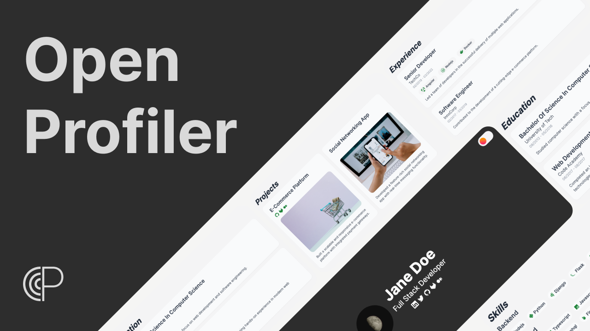

# Open Profiler

    

## Overview

Open Profiler is an open-source project that serves as a personal portfolio template built with Angular. It is designed to be easily forked and customized, allowing anyone to create and showcase their personal or professional profile. Contributions from the community are welcome, making it a collaborative effort to enhance and improve the template.

## How to Use

1. **Fork the Repository**: Start by forking the repository to your GitHub account.

2. **Install Dependencies**: Execute `npm install` to install the required dependencies.

3. **Configure Open Profiler**: Customize the Open Profiler configuration by updating the [CONFIG](./config/open-profiler.config.json) object with your information. Refer to the [GUIDELINES](./src/app/shared/config/README.md) for detailed instructions.

4. **Configure Seo Meta Tags**: Update the [CONFIG](./config/seo.config.json) object with your specific information for SEO meta tags.

5. **Build**:

   - Push a tag and let GitHub Actions manage the build process. Afterward, access the compiled files from the releases.
   - Alternatively, build the project locally by running npm run build.

6. **Deploy**: Deploy your personalized portfolio from the (./dist/<name-project>/browser/) directory using your preferred hosting service.

## How to Contribute

We welcome contributions! If you have ideas or want to improve Open Profiler, read [CONTRIBUTING](CONTRIBUTING.md).

## License

Open Profiler is licensed under the [MIT License](LICENSE).
